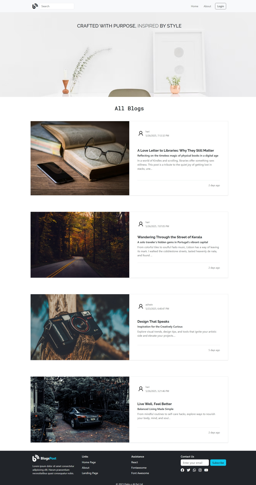

#  Y-Shope

## Description
This project is built using **React.js** working in Vite and **Node.js** for the backend. It follows the **MVC architecture** and uses **MongoDB** as the database. The project includes CRUD operations and the manage data efficiently.

This project is a dynamic, full-featured blogging website designed to provide a seamless platform for both public visitors and registered users. Public users can freely browse and read a wide variety of blogs, gaining insights and inspiration across multiple topics. **Registered** users can create their own blogs by signing up and **logging** into their accounts, allowing them to share their thoughts and stories with the community.

Users have full control over their content — they can easily create new blogs, edit existing posts, and delete blogs they no longer want to keep. The platform supports user **authentication** and **session management**, ensuring secure and personalized access.

Built with a modern tech stack, this blogging site features an intuitive interface, responsive design, and smooth navigation to enhance the user experience for all visitors. Whether you're a casual reader or an active content creator, this site offers everything you need for engaging blogging and reading.

## Getting Started

1. **Install dependencies:**

   ```bash
   npm install
2. **Start running:**

   ```bash
   npm run dev


### 🔗 Backend Repository

👉 [Backend GitHub Repo](https://github.com/harikrishnan2193/blogging_website_backend)

### 🖼️ Screenshot



### 🚀 Live Demo

[Click here to try the live app](https://blogging-website-frontend-omega.vercel.app/)